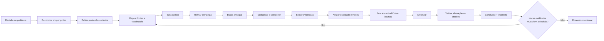
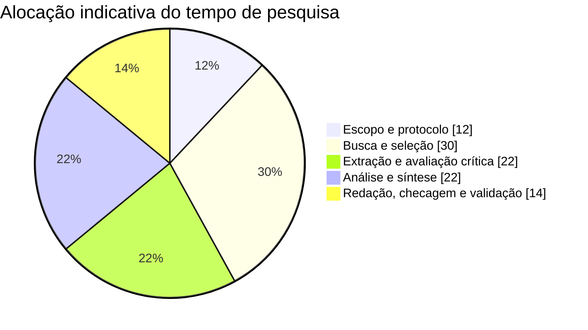
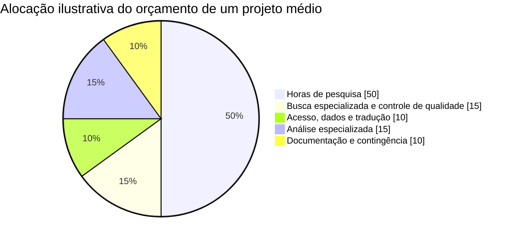
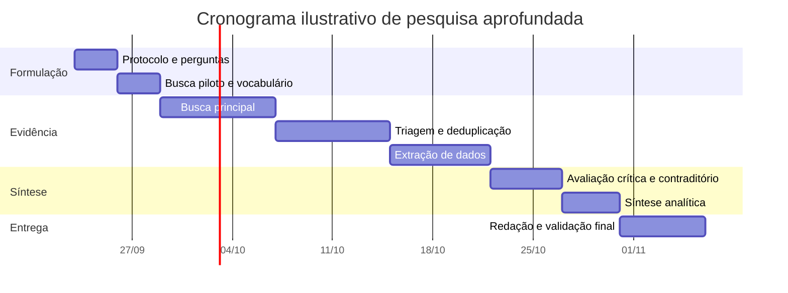

# Pesquisa aprofundada: metodologia prática, rigorosa e reproduzível para investigação multidisciplinar

> **Nota de arquivamento (22/09/2026):** este é o relatório metodológico original que
> serve como espinha dorsal de pesquisa do projeto *Write with AI*.
> Os tokens de citação da conversa original foram convertidos em placeholders
> `[verify: …]` — cada um deve ser resolvido via `research/claim-register.md`
> antes que qualquer afirmação dependente entre no manuscrito.
> Números dinâmicos (ex.: contagens da BDTD) são snapshots da data de consulta.
>
> **Archival note (2026-09-22):** this is the original methodology report serving as
> this project's research backbone. Original conversation citation tokens were
> converted to `[verify: …]` placeholders — each must be resolved through
> `research/claim-register.md` before any dependent claim enters the manuscript.

## Resumo executivo

“Pesquisa aprofundada” não é, por si só, um desenho metodológico universalmente padronizado. No meio acadêmico, o que popularmente se chama de pesquisa aprofundada pode assumir formas bastante diferentes — revisão sistemática, revisão de escopo, síntese qualitativa, estudo observacional, experimento, análise documental, estudo de caso ou métodos mistos — e a escolha correta depende da pergunta. No contexto recente de agentes de inteligência artificial, o termo *deep research* passou a designar investigações que exigem busca extensa, ramificação entre conceitos, verificação de múltiplas fontes e síntese; um trabalho apresentado no ICLR 2026 argumenta justamente que o que caracteriza esse tipo de tarefa não é produzir um relatório longo, mas realizar exploração ampla e intensiva em raciocínio. [verify: turn21search5]

A conclusão central deste relatório é que **profundidade de pesquisa não deve ser medida pelo número de páginas, pelo número de fontes ou pelo tempo gasto**. Uma investigação é realmente profunda quando existe uma cadeia auditável:

**decisão → pergunta → protocolo → busca → seleção → extração → avaliação crítica → triangulação → síntese → contraditório → conclusão → incerteza → atualização.**

Essa concepção é consistente com as práticas consolidadas de síntese de evidências. O PRISMA 2020, por exemplo, organiza a transparência de revisões sistemáticas em uma checklist de 27 itens e diagramas de fluxo; a Cochrane recomenda participação de especialistas em informação, documentação rigorosa e revisão da estratégia de busca; e o EQUATOR mantém diretrizes específicas para diferentes desenhos, como CONSORT, STROBE, PRISMA, COREQ, SRQR, CHEERS e outros. [verify: turn15search1, turn15search11, turn15search0]

Para uma metodologia multidisciplinar, o princípio mais importante é **adequação entre afirmação e evidência**. Uma lei deve ser verificada no texto normativo oficial; uma estatística populacional, preferencialmente na base que a produz; um efeito causal, em desenhos capazes de sustentar inferência causal; uma experiência humana, por métodos qualitativos adequados; uma estimativa agregada, idealmente por sínteses metodologicamente robustas. “Fonte primária” não significa automaticamente “fonte superior” em qualquer situação: para saber o resultado geral de dezenas de ensaios, uma boa revisão sistemática pode ser mais útil que um único estudo primário; para saber o conteúdo de uma lei, a legislação oficial é superior a uma revisão acadêmica.

No Brasil há uma infraestrutura particularmente relevante para esse processo. O Portal de Periódicos da CAPES reúne periódicos, artigos, bases de texto completo e referenciais, livros, normas, patentes, estatísticas, teses e dissertações; o SciELO constitui infraestrutura de comunicação científica em acesso aberto; o Oasisbr agrega produção científica brasileira e portuguesa em acesso aberto; e a BDTD integra teses e dissertações, registrando, no recorte consultado, **1.108.742 documentos de 166 instituições**. [verify: turn14search0, turn14search2, turn19search3, turn14search10]

A recomendação operacional resultante desta pesquisa é adotar um modelo em quatro camadas:

| Camada | Pergunta de controle | Resultado esperado |
|---|---|---|
| Formulação | “Qual decisão esta pesquisa deve melhorar?” | pergunta delimitada, critérios e protocolo |
| Evidência | “Qual é a fonte mais próxima e confiável para cada afirmação?” | corpus rastreável e diversificado |
| Validação | “O que poderia tornar essa conclusão falsa, enviesada ou não generalizável?” | avaliação crítica, contraditório e triangulação |
| Síntese | “O que sabemos, com que confiança, para quem, quando e sob quais condições?” | conclusão calibrada e acionável |

A metodologia abaixo foi concebida como um **sistema operacional de pesquisa**, não como substituto de protocolos disciplinares. Em medicina, direito, economia, engenharia, ciências sociais ou inteligência competitiva, os instrumentos específicos devem mudar; a lógica de rastreabilidade, adequação da evidência, contraditório e transparência permanece.

## Objetivos, escopo, definições e perguntas prioritárias

**Objetivo principal.** Construir um método geral para conduzir pesquisa aprofundada com rigor suficiente para fundamentar decisões acadêmicas, profissionais, empresariais e de políticas públicas, sem confundir volume de informação com qualidade da evidência.

**Objetivos secundários.** O método precisa permitir: descobrir o estado do conhecimento; identificar consenso e dissenso; encontrar dados primários; distinguir evidência de opinião; detectar lacunas; quantificar incerteza quando possível; registrar o caminho entre fonte e conclusão; e tornar a pesquisa atualizável em vez de produzir um documento que envelhece sem rastreabilidade.

**Escopo.** O foco aqui é principalmente pesquisa documental e baseada em evidências, incluindo literatura científica, documentos oficiais, legislação, dados públicos, relatórios técnicos e, quando adequado, dados empíricos originais. Não se pretende impor um único método a todas as disciplinas. A própria biblioteca EQUATOR distingue diretrizes para ensaios randomizados, estudos observacionais, pesquisas qualitativas, revisões sistemáticas, estudos diagnósticos, avaliações econômicas e outros desenhos, demonstrando que tipos distintos de pergunta demandam padrões distintos de investigação e relato. [verify: turn15search0, turn15search4]

Uma distinção essencial é entre **pesquisar**, **revisar literatura** e **sintetizar evidência**:

- uma busca simples tenta localizar informação;
- uma revisão narrativa organiza conhecimento segundo julgamento do pesquisador;
- uma revisão de escopo mapeia extensão, conceitos, tipos de evidência e lacunas de um campo;
- uma revisão sistemática utiliza métodos previamente definidos para localizar, selecionar, avaliar e sintetizar estudos que respondem a uma pergunta delimitada;
- uma meta-análise combina quantitativamente resultados quando os estudos e medidas permitem;
- uma pesquisa empírica primária produz novos dados.

Um guia brasileiro publicado pela UFLA em 2025 para “revisão sistemática e aprofundada da literatura” enfatiza pergunta de pesquisa, critérios de inclusão e exclusão, busca em bases, avaliação crítica e síntese, em linha com princípios internacionais de transparência metodológica. [verify: turn22search1]

**Definição operacional adotada neste relatório:**

> Pesquisa aprofundada é um processo iterativo e documentado de decomposição de uma pergunta complexa em afirmações verificáveis, localização e avaliação de evidências adequadas a cada afirmação, confronto de explicações concorrentes e síntese das conclusões com rastreabilidade explícita e incerteza calibrada.

Essa definição é propositalmente mais ampla que “revisão sistemática”. Ela também é compatível com o conceito emergente de *deep research* computacional, no qual a dificuldade está na quantidade de caminhos informacionais que precisam ser explorados e integrados, e não no simples comprimento da resposta. [verify: turn21search5]

**As perguntas devem ser priorizadas antes da busca**, porque pesquisar sem uma hierarquia de perguntas gera coleta indiscriminada.

| Prioridade | Pergunta | Função |
|---|---|---|
| Crítica | **Que decisão ou conclusão esta pesquisa precisa sustentar?** | impede pesquisa sem finalidade |
| Crítica | **Como os conceitos centrais são definidos e medidos?** | evita comparar constructos diferentes |
| Alta | **O que as melhores evidências mostram?** | estabelece resultado principal |
| Alta | **Qual a magnitude, direção e incerteza do efeito/fenômeno?** | evita conclusões apenas binárias |
| Alta | **Em que populações, locais, épocas e condições o resultado muda?** | testa generalização |
| Alta | **Que evidência contradiz a hipótese dominante?** | combate viés de confirmação |
| Média | **Quais mecanismos poderiam explicar os resultados?** | separa associação de explicação |
| Média | **Quais riscos, vieses e conflitos de interesse existem?** | calibra confiança |
| Média | **Quais lacunas impedem conclusão mais forte?** | direciona novas investigações |
| Operacional | **Que informação nova realmente mudaria a decisão?** | define quando parar |

A escolha da estrutura da pergunta também varia pela disciplina. Em saúde e intervenções, o modelo PICO — população/paciente, intervenção, comparação e desfecho — é amplamente utilizado; a Biblioteca Virtual em Saúde do Ministério da Saúde ressalta que uma pergunta bem estruturada melhora a recuperação da evidência e reduz buscas desnecessárias. [verify: turn11search3] Já revisões de escopo costumam utilizar estruturas mais amplas, pois seu objetivo é mapear conceitos e contexto, não necessariamente estimar um único efeito.

Um bom teste inicial é obrigar a pergunta a conter **objeto + população/unidade + comparação, quando pertinente + resultado + contexto + período**.

Em vez de:

> “IA melhora produtividade?”

formular:

> “Entre profissionais que executam tarefas intensivas em texto, qual é o efeito do uso assistido de IA generativa sobre tempo, quantidade e qualidade da produção, comparado ao trabalho sem IA, e como os resultados variam por experiência profissional e tipo de tarefa?”

A diferença parece editorial, mas modifica radicalmente a busca, a seleção de estudos e a interpretação.

## Arquitetura metodológica, estratégia de busca e fontes

Para este relatório foi realizada uma **síntese narrativa estruturada**, não uma revisão sistemática formal. Foram priorizados documentos oficiais brasileiros e fontes metodológicas primárias ou institucionais, complementados por artigos empíricos originais. Entre as fontes consultadas estão CAPES, CNPq, Ibict/BDTD/Oasisbr, SciELO, Ministério da Saúde/CNS, ANPD, Planalto, Portal Brasileiro de Dados Abertos, PRISMA, Cochrane, JBI, EQUATOR e artigos originais usados no estudo de caso. Portanto, as conclusões são metodologicamente fundamentadas, mas não se deve interpretar este relatório como uma busca bibliográfica exaustiva de toda a literatura sobre ciência da informação ou metodologia de pesquisa. [verify: turn14search0, turn18search0, turn19search3, turn15search1, turn15search11]

O fluxo recomendado é:



**O protocolo deve existir antes da coleta substancial.** Ele não precisa ter dezenas de páginas. Para pesquisas profissionais, uma ou duas páginas podem bastar; para uma revisão sistemática destinada à publicação científica, será necessário seguir padrões muito mais rigorosos. O princípio é registrar antecipadamente pergunta, escopo, fontes, critérios, variáveis e plano de análise para reduzir a liberdade de mudar silenciosamente o método depois de observar resultados. Evidências clássicas mostram por que isso importa: Simmons, Nelson e Simonsohn demonstraram, em simulações, que a combinação de quatro graus de liberdade analíticos podia elevar dramaticamente a taxa de falsos positivos, chegando a 61% na configuração simulada estudada. Isso não significa que “61% da ciência é falsa”; significa que flexibilidade analítica não reportada pode alterar profundamente a confiabilidade inferencial. [verify: turn20search0, turn20search1]

### Como construir a busca

A estratégia mais robusta tende a ser **iterativa**, e não uma única consulta gigantesca.

Comece com uma busca piloto para localizar estudos-semente, terminologia especializada, autores, instituições, descritores e sinônimos. Em seguida, converta isso em blocos conceituais e execute a busca nas bases adequadas. A Cochrane recomenda combinar termos livres com vocabulários indexados e, em revisões de alto rigor, envolver bibliotecário ou especialista em informação desde as etapas iniciais; também recomenda fortemente revisão por pares das estratégias de busca antes de sua execução definitiva. [verify: turn15search6, turn15search11]

Um padrão genérico seria:

```text
CONCEITO A
("generative AI" OR "generative artificial intelligence" OR ChatGPT OR "large language model*")

AND

CONCEITO B
(productiv* OR efficiency OR performance OR "task completion time")

AND

CONCEITO C
(worker* OR employee* OR professional* OR workplace)
```

Para literatura brasileira, repita quando pertinente os conceitos em português:

```text
("inteligência artificial generativa" OR "IA generativa")
AND
(produtividade OR desempenho OR eficiência)
AND
(trabalhador* OR profissional* OR trabalho)
```

Não é recomendável simplesmente traduzir uma estratégia palavra por palavra. Vocabulários controlados, convenções das bases e terminologia de cada país podem ser diferentes.

**Registro mínimo da busca:**

| Campo | Exemplo de preenchimento |
|---|---|
| Pergunta | efeito da IA generativa sobre produtividade |
| Base/fonte | CAPES / SciELO / PubMed / site oficial |
| Consulta exata | expressão completa usada |
| Data da busca | 22/09/2026 |
| Filtros | 2022–2026; humanos; artigos |
| Resultados brutos | n |
| Exportados | n |
| Duplicatas removidas | n |
| Incluídos após título/resumo | n |
| Incluídos após texto integral | n |
| Observações | alteração de vocabulário, indisponibilidade etc. |

Para revisões sistemáticas, PRISMA 2020 oferece checklist de 27 itens e diagramas que tornam identificações, exclusões e inclusões transparentes. É importante não transformar essa recomendação em uma falsa garantia de qualidade: uma diretriz de relato serve para informar de maneira completa o que foi feito; não substitui uma avaliação metodológica do estudo. A própria definição do EQUATOR trata essas diretrizes como ferramentas estruturadas para **relatar** pesquisas. [verify: turn15search1, turn15search4]

### Onde pesquisar primeiro no contexto brasileiro

Em vez de usar um ranking fixo de websites, deve-se buscar a **fonte mais próxima do fenômeno ou ato**.

| Necessidade | Fonte prioritária | Uso |
|---|---|---|
| Lei ou regulação brasileira | Planalto, Diário Oficial, órgão regulador | texto legal e vigência |
| Estatísticas oficiais | IBGE, órgãos produtores, dados.gov.br | séries e dados primários |
| Literatura acadêmica ampla | Portal CAPES | descoberta e acesso a bases |
| Literatura latino-americana | SciELO | artigos e ciência aberta |
| Produção brasileira aberta | Oasisbr | artigos, livros, dados, teses |
| Teses e dissertações | BDTD | literatura acadêmica não limitada a periódicos |
| Saúde | BVS, bases especializadas | literatura biomédica e institucional |
| Normas de pesquisa | CNPq, CNS/Conep, ANPD | integridade, ética e proteção de dados |
| Dados governamentais | dados.gov.br / APIs oficiais | análises quantitativas reproduzíveis |

O Portal CAPES declara reunir periódicos, artigos, bases de texto completo e referenciais, normas, patentes, estatísticas, livros, teses e dissertações, com conteúdos abertos disponíveis a qualquer usuário e conteúdos contratados acessíveis conforme vínculo institucional. [verify: turn14search0, turn14search3]

O Oasisbr, operado pelo Ibict, oferece busca multidisciplinar e gratuita em produção científica aberta de instituições brasileiras, incluindo artigos, teses e dissertações, conjuntos de dados e livros, além de fontes portuguesas. A BDTD, também coordenada pelo Ibict, integra sistemas de teses e dissertações de instituições brasileiras; o retrato consultado apresentava 789.430 dissertações, 319.312 teses e 1.108.742 documentos no total. Esses números devem ser tratados como um *snapshot* da consulta, pois o acervo é dinâmico. [verify: turn19search3, turn14search10]

O SciELO foi criado em 1997 e lançado em 1998 e evoluiu para uma infraestrutura de comunicação científica aberta que inclui coleções de periódicos, SciELO Preprints, SciELO Data e SciELO Livros. Isso o torna especialmente importante quando a pesquisa precisa reduzir a dependência de bases predominantemente anglófonas. [verify: turn14search2]

Para dados públicos, estruturas legíveis por máquina são preferíveis a documentos que exigem extração manual. A Receita Federal, por exemplo, determina para seu repositório de dados abertos formatos estruturados e não proprietários como CSV, JSON, XML, ODS e RDF e alerta que publicar uma planilha como PDF dificulta sua reutilização. A API do Portal Brasileiro de Dados Abertos disponibiliza consultas via REST/JSON. [verify: turn19search0, turn19search1]

### Avaliação de fonte

Um sistema simples e multidisciplinar pode pontuar cada fonte de 0 a 2 em seis dimensões:

| Critério | 0 | 1 | 2 |
|---|---|---|---|
| Proveniência | desconhecida | indireta | produtor/original |
| Método | ausente | parcial | explicitamente documentado |
| Proximidade ao dado | opinião | síntese indireta | evidência/dado original |
| Atualidade | incompatível | aceitável | adequada ao fenômeno |
| Independência | conflito não tratado | possível conflito | independência/transparência |
| Reprodutibilidade | impossível | parcial | dados/método verificáveis |

**O total não deve substituir julgamento especializado.** Uma lei oficial antiga ainda pode ser a fonte correta se estiver vigente; um artigo muito recente pode ser metodologicamente fraco; uma página empresarial pode ser a melhor fonte para documentar as especificações do próprio produto, mas não necessariamente para avaliar sua superioridade.

Uma regra particularmente útil é:

> **Descubra com fontes secundárias; conclua, sempre que possível, a partir da fonte primária ou da melhor síntese disponível.**

Assim, uma matéria jornalística pode indicar que uma nova regulamentação existe; a conclusão jurídica deve retornar ao ato oficial. Um post pode mencionar um artigo científico; a extração do resultado deve retornar ao artigo. Uma IA pode sugerir uma referência; a referência precisa existir e seu conteúdo deve ser conferido.

### Extração estruturada de dados

Uma pesquisa começa a ficar realmente auditável quando as informações deixam de existir apenas nas anotações do pesquisador.

**Template de extração:**

| ID | Afirmação/pergunta | Fonte | Tipo de fonte | População/contexto | Desenho/amostra | Medida | Resultado | Incerteza | Limitações/vieses | Financiamento/conflito | Aplicabilidade | Observação |
|---|---|---|---|---|---|---|---|---|---|---|---|---|
| E01 |  |  |  |  |  |  |  |  |  |  |  |  |
| E02 |  |  |  |  |  |  |  |  |  |  |  |  |
| E03 |  |  |  |  |  |  |  |  |  |  |  |  |

Essa estrutura permite separar três coisas que costumam ser misturadas: **o que o estudo encontrou**, **o que os autores interpretaram** e **o que o pesquisador está inferindo**.

## Síntese da literatura, evidência empírica, controvérsias e lacunas

A literatura metodológica converte a ideia vaga de “pesquisar muito” em alguns princípios bastante estáveis.

**Primeiro: pergunta e método devem ser acoplados.** Não existe uma hierarquia de evidência totalmente independente da pergunta. Ensaios randomizados são valiosos para certos problemas causais; estudos observacionais são indispensáveis para outros fenômenos; pesquisa qualitativa pode ser superior quando o interesse é compreender experiências, valores, barreiras e processos sociais. O JBI destaca justamente que sínteses qualitativas conseguem explorar significados, experiências, atitudes e processos que investigação quantitativa isolada não capta integralmente. [verify: turn16search0]

**Segundo: rastreabilidade é parte do resultado.** PRISMA formaliza a necessidade de relatar como os estudos foram identificados e selecionados; EQUATOR generaliza a ideia de que relatórios científicos precisam conter informação suficiente para compreensão e reprodução; Cochrane enfatiza documentação da estratégia de busca e recomenda revisão por especialista. [verify: turn15search1, turn15search4, turn15search11]

**Terceiro: largura de cobertura e profundidade analítica são coisas diferentes.** Uma revisão de escopo pode mapear um campo muito amplo sem tentar produzir uma única estimativa causal; uma revisão sistemática estreita pode investigar profundamente uma pergunta específica. A literatura JBI ressalta que revisões de escopo não são simplesmente versões “fáceis” de revisões sistemáticas e devem ser conduzidas com rigor, transparência e confiabilidade. [verify: turn16search3]

**Quarto: transparência analítica é necessária porque decisões tomadas depois de observar os dados podem alterar resultados.** As simulações de Simmons e colegas mostram concretamente como flexibilidades aparentemente razoáveis em variáveis, tamanho de amostra, covariáveis e condições podem inflar falsos positivos. [verify: turn20search0, turn20search1]

**Quinto: publicação não é sinônimo de verdade estabelecida.** No projeto de replicação da Open Science Collaboration, 100 estudos experimentais e correlacionais de psicologia foram replicados. Cerca de 97% dos estudos originais haviam produzido resultados estatisticamente significativos, contra 36% das replicações, e o efeito médio das replicações foi aproximadamente metade do observado nos originais. Esses números são importantes como evidência de problemas de reprodutibilidade naquele conjunto específico de estudos de psicologia; não constituem uma estimativa de “quanto de toda a ciência está errado”. [verify: turn20search4, turn20search11]

Uma pesquisa aprofundada deve, portanto, perguntar não apenas “há um artigo?”, mas:

**houve replicação? há convergência entre desenhos independentes? o resultado depende de escolhas analíticas? qual o intervalo de incerteza? a população estudada corresponde à população sobre a qual estou concluindo?**

### Evidências que ajudam a justificar o método

| Evidência | Resultado observado | Implicação metodológica |
|---|---:|---|
| PRISMA 2020 | checklist com 27 itens | relatar busca, seleção e síntese de forma auditável |
| Open Science Collaboration | 100 replicações; 97% → 36% de resultados significativos | não equiparar publicação isolada a evidência consolidada |
| Simmons et al. | até 61% de falsos positivos na combinação simulada de flexibilidades | antecipar decisões analíticas e documentar desvios |
| Noy & Zhang | 453 profissionais; tempo −40%, qualidade +18% em tarefas estudadas | observar tamanho do efeito e limites do contexto |
| Brynjolfsson, Li & Raymond | 5.179 agentes; produtividade +14% em média, +34% para novatos/menos qualificados | procurar heterogeneidade, não apenas média |

Fontes: PRISMA, estudo de reprodutibilidade, experimento de flexibilidade analítica e estudos originais de IA/produtividade. [verify: turn15search1, turn20search4, turn20search1, turn20search9, turn20search7]

### Controvérsias que uma boa pesquisa precisa administrar

**Exaustividade versus velocidade.** Uma busca perfeitamente exaustiva tem custos crescentes. Para uma diretriz clínica, perder um estudo crítico pode ter consequências relevantes; para uma decisão empresarial reversível, três meses adicionais de busca podem custar mais que a redução marginal da incerteza. Logo, profundidade deve ser proporcional ao custo de estar errado.

**Hierarquia de evidência versus adequação da evidência.** Colocar todos os desenhos em uma escala única leva a erros. Uma pesquisa qualitativa não é “inferior” quando a pergunta é “por que usuários abandonam o produto?”. Um ensaio randomizado não é a ferramenta correta para verificar a redação de uma lei. A avaliação precisa ser *claim-specific*.

**Literatura publicada versus literatura cinzenta.** Teses, relatórios governamentais, registros, documentos técnicos e dados administrativos podem reduzir vieses de publicação e oferecer informação que não aparece em periódicos, mas sua qualidade é heterogênea. No Brasil, BDTD e Oasisbr facilitam justamente a descoberta de parte desse universo. [verify: turn14search10, turn19search3]

**Profundidade versus atualidade.** Uma revisão excepcionalmente rigorosa pode estar desatualizada em áreas de rápida evolução. Em IA, segurança cibernética, regulação e software, a data da evidência deve ser tratada como variável metodológica, não como detalhe bibliográfico.

**Automação versus verificabilidade.** Sistemas de IA são úteis para decompor perguntas, gerar sinônimos, localizar estudos-semente, estruturar tabelas e comparar documentos; porém, não devem transformar uma referência sugerida em fato sem verificação na fonte. A própria literatura recente sobre sistemas de *deep research* ainda identifica lacunas de cobertura e raciocínio, enquanto o trabalho do ICLR 2026 encontrou desempenho bastante desigual entre sistemas e tarefas. [verify: turn21search5]

No contexto brasileiro, há ainda uma obrigação contemporânea relevante: as diretrizes de integridade do CNPq, atualizadas em março de 2026, determinam que, em pesquisa científica apoiada pelo órgão, o uso de ferramentas de IA generativa seja declarado independentemente da fase — incluindo concepção, redação, análise de dados e submissão — com indicação da ferramenta e finalidade. Em 2026 o CNPq também instituiu formalmente sua Política de Integridade na Atividade Científica por meio da Portaria nº 2.664/2026. [verify: turn18search10, turn18search0, turn18search6]

### Ética, privacidade e governança dos dados

Profundidade metodológica não autoriza coleta indiscriminada. No Brasil, pesquisas envolvendo seres humanos estão sujeitas a regras éticas específicas; o Conselho Nacional de Saúde mantém a Resolução nº 466/2012 como norma em vigor e a Resolução nº 510/2016 disciplina pesquisas em Ciências Humanas e Sociais envolvendo dados diretamente obtidos de participantes, informações identificáveis ou riscos superiores aos da vida cotidiana. [verify: turn22search2, turn22search13]

O tratamento de dados pessoais também precisa ser avaliado à luz da LGPD e das orientações da ANPD. Para estudos em saúde pública, o art. 13 da LGPD estabelece condições específicas de tratamento em ambiente controlado e seguro e prevê, quando possível, anonimização ou pseudonimização; a divulgação dos resultados não pode revelar dados pessoais. A ANPD mantém guia específico sobre tratamento de dados pessoais para fins acadêmicos, estudos e pesquisas. [verify: turn18search4, turn18search7, turn18search2]

Isso introduz uma fronteira importante:

> **“Consigo obter os dados?” é uma pergunta técnica. “Posso tratá-los, para essa finalidade, dessa maneira?” é também uma pergunta jurídica e ética.**

### Principais lacunas

A primeira lacuna é conceitual: ainda não há um padrão universal denominado “metodologia de pesquisa aprofundada”; *deep research* permanece uma categoria emergente quando aplicada a agentes de IA. [verify: turn21search5]

A segunda é operacional: não existe orçamento ou duração universal para uma pesquisa “profunda”. O custo cresce com amplitude, número de bases, necessidade de acesso integral, revisão por pares, idiomas, obtenção de dados, dupla triagem, codificação, análise estatística e expertise disciplinar.

A terceira é linguística e geográfica. Um procedimento que pesquise apenas em inglês e em grandes indexadores internacionais pode perder conhecimento brasileiro e latino-americano; CAPES, SciELO, Oasisbr e BDTD são complementos importantes nesse cenário. [verify: turn14search0, turn14search2, turn19search3, turn14search10]

A quarta é tecnológica: ferramentas de automação conseguem ampliar muito a capacidade de descoberta e síntese, mas isso aumenta — não reduz — a importância de mecanismos que permitam rastrear **qual fonte sustenta qual afirmação**.

## Métodos, fontes, cronogramas, orçamento e alocação de recursos

A seleção metodológica deve começar pela pergunta, não pela ferramenta disponível.

| Método | Melhor uso | Fontes/dados | Produto | Principal limitação |
|---|---|---|---|---|
| Revisão narrativa estruturada | compreensão rápida e analítica | literatura selecionada | síntese temática | maior dependência do julgamento do autor |
| Revisão rápida | decisão com prazo rígido | subconjunto protocolizado | síntese acelerada | simplificações podem reduzir cobertura |
| Revisão de escopo | campo amplo/emergente | múltiplos desenhos | mapa de evidências/lacunas | geralmente não responde uma pergunta causal estreita |
| Revisão sistemática | pergunta delimitada | estudos recuperados por protocolo | síntese reprodutível | alta demanda de tempo e equipe |
| Meta-análise | efeitos comparáveis | resultados quantitativos | estimativa agregada | “garbage in, garbage out”; heterogeneidade |
| Análise documental | normas, políticas, contratos, documentos históricos | documentos primários | interpretação estruturada | acesso e contexto documental |
| Estudo observacional | prevalência, associação, tendências | dados existentes ou coletados | estimativas empíricas | confundimento e seleção |
| Experimento | efeito causal de intervenção | dados primários | comparação controlada | custo, ética e validade externa |
| Estudo qualitativo | experiências, mecanismos sociais, significados | entrevistas, grupos, documentos | temas/modelos interpretativos | generalização estatística não é objetivo |
| Estudo de caso | processo em contexto real | múltiplas evidências | explicação contextual profunda | generalização requer cautela |
| Métodos mistos | questões multidimensionais | quantitativos + qualitativos | triangulação | integração é metodologicamente exigente |

A diversidade de metodologias e respectivas diretrizes de relato é refletida pela biblioteca EQUATOR, que diferencia explicitamente ensaios, estudos observacionais, qualitativos, revisões, protocolos, diagnósticos e avaliações econômicas. [verify: turn15search0]

### Cenários de prazo e orçamento

Os valores abaixo **não são cotações de mercado nem estatísticas observadas**. São cenários de planejamento construídos para permitir dimensionamento do projeto em reais de 2026. Devem ser substituídos pelos custos efetivos de pessoal, bases, tradução, software, coleta e especialistas do projeto concreto.

| Cenário | Prazo indicativo | Esforço | Custo direto ilustrativo | Configuração | Uso adequado |
|---|---:|---:|---:|---|---|
| **Baixo** | 1–2 semanas | 20–40 h | R$ 0–2 mil | pesquisador único, fontes abertas, revisão estruturada | decisão exploratória/reversível |
| **Médio** | 4–8 semanas | 60–120 h | R$ 5–20 mil | pesquisador + revisão independente/especialista pontual | relatório estratégico, estado da arte |
| **Alto** | 3–6+ meses | 150–400+ h | R$ 30–150 mil+ | equipe, bibliotecário, dupla triagem, análise especializada, possível coleta primária | revisão de alta consequência, pesquisa institucional |

Em projetos acadêmicos, horas de servidores, docentes ou pesquisadores frequentemente não aparecem como “custo direto”; numa análise econômica real elas deveriam ser consideradas como custo de oportunidade.

Uma alocação inicial razoável para um projeto de média complexidade pode ser:



O erro frequente é destinar quase todo o tempo à busca e reservar poucas horas para confrontar estudos e verificar afirmações. A síntese não é uma etapa cosmética; é onde evidências heterogêneas são convertidas em conclusão.

No cenário médio, uma distribuição orçamentária poderia assumir, apenas para planejamento:



Um cronograma de seis semanas iniciado imediatamente após a data deste relatório poderia ser:



O nível de garantia deve aumentar com o **custo do erro**. Uma decisão reversível de marketing talvez aceite revisão rápida; uma recomendação clínica ou decisão jurídica relevante não deveria utilizar o mesmo grau de simplificação.

Um modelo útil é:

\[
\text{Esforço ótimo de pesquisa}
\propto
\text{impacto do erro}
\times
\text{incerteza atual}
\times
\text{irreversibilidade}
\]

A expressão é conceitual, não uma fórmula estatística validada. Seu objetivo é impedir que todos os problemas recebam indiscriminadamente o mesmo orçamento.

## Estudo de caso: a IA generativa aumenta a produtividade profissional?

Este exemplo mostra por que uma pesquisa aprofundada não deve parar no primeiro estudo positivo.

**Decisão.** Uma empresa pretende decidir se deve implantar um assistente de IA generativa em atividades de produção textual e atendimento.

**Pergunta inicial inadequada:**

> “IA aumenta produtividade?”

Ela é ampla demais: “IA”, “produtividade” e “trabalho” podem significar dezenas de coisas.

**Pergunta operacional:**

> “Para profissionais executando tarefas textuais ou atendimento baseado em conhecimento, o acesso a um assistente de IA generativa aumenta produção ou qualidade e reduz tempo, em comparação ao processo sem IA, e os efeitos variam conforme experiência?”

**Hipótese favorável.** A IA reduz esforço para produzir, recuperar ou organizar conhecimento e eleva produtividade.

**Hipótese concorrente.** Os ganhos ocorrem apenas em tarefas simples, em condições experimentais, ou desaparecem após contabilizar erros, revisão, aprendizagem e tarefas fora do escopo da ferramenta.

**Desfechos desejados:** tempo por tarefa, tarefas concluídas por unidade de tempo, qualidade, erros, satisfação e heterogeneidade por experiência.

### Evidência primária

Noy e Zhang realizaram um experimento randomizado e pré-registrado com **453 profissionais com formação superior**, usando tarefas profissionais incentivadas de escrita. O acesso ao ChatGPT reduziu o tempo médio em cerca de **40%** e elevou a qualidade avaliada em **18%** nas tarefas estudadas. O grupo exposto também apresentou maior probabilidade de relatar uso da ferramenta no trabalho posteriormente. [verify: turn20search5, turn20search9]

Uma conclusão rasa seria:

> “ChatGPT aumenta produtividade em 40%.”

Isso estaria errado por pelo menos três motivos. Os 40% referem-se à redução média de tempo naquele desenho e conjunto de tarefas, não a um aumento universal de produtividade; a amostra era específica; e produtividade organizacional envolve mais fatores que velocidade de redação.

Uma segunda fonte primária ajuda a testar generalização. Brynjolfsson, Li e Raymond estudaram a introdução escalonada de um assistente de IA para **5.179 agentes de suporte ao cliente**. O acesso ao sistema elevou a produtividade, medida por problemas resolvidos por hora, em aproximadamente **14% em média**, mas o efeito foi muito maior — cerca de **34%** — entre trabalhadores novatos ou menos qualificados, enquanto foi pequeno entre os mais experientes. [verify: turn20search7]

Agora surgem três achados mais interessantes que a manchete “IA aumenta produtividade”:

| Questão | Noy & Zhang | Brynjolfsson et al. | Síntese |
|---|---|---|---|
| Há ganho? | Sim, nas tarefas estudadas | Sim, no atendimento estudado | convergência positiva |
| O tamanho é igual? | não diretamente comparável | não | efeito depende da métrica/contexto |
| Todos ganham igualmente? | diferenças de desempenho foram reduzidas | novatos ganharam mais | forte heterogeneidade por habilidade |
| É prova de ganho macroeconômico? | não | não | extrapolação seria indevida |

Fontes dos resultados experimentais e de campo. [verify: turn20search9, turn20search7]

### Síntese corretamente calibrada

Uma conclusão melhor seria:

> **Há evidência causal e de campo consistente de que assistência por IA generativa pode aumentar produtividade em determinados trabalhos intensivos em linguagem, com ganhos especialmente relevantes para trabalhadores menos experientes; porém, os estudos não justificam tratar a magnitude observada como efeito universal sobre todos os profissionais, atividades, organizações ou horizontes temporais.** [verify: turn20search9, turn20search7]

Observe a diferença. A conclusão mantém o sinal favorável da evidência, mas preserva quatro limites: população, tarefa, implementação e tempo.

### Próxima busca que realmente adicionaria valor

Em vez de coletar mais vinte artigos que repetem a mesma tese, uma pesquisa profunda procuraria deliberadamente:

- estudos com tarefas nas quais IA prejudica qualidade;
- evidência longitudinal de aprendizagem ou dependência;
- efeitos sobre profissionais experientes;
- custos de revisão e correção;
- incidência de erros;
- diferentes modelos e organizações;
- efeitos sobre qualidade final, não só velocidade;
- externalidades sobre emprego, competências e organização do trabalho.

Esse é o ponto em que “deep research” se diferencia de uma compilação: **o próximo passo é determinado pela lacuna que mais pode mudar a conclusão**, e não pela facilidade de encontrar mais fontes favoráveis.

O caso também mostra por que cada afirmação quantitativa deve manter sua unidade. “40% menos tempo”, “18% mais qualidade” e “14% mais problemas resolvidos por hora” são métricas diferentes; colocá-las numa mesma coluna como “ganho de produtividade” sem preservar sua definição destruiria parte da evidência original. [verify: turn20search9, turn20search7]

## Recomendações práticas, checklist, templates, limitações e questões abertas

A melhor implementação geral é tratar a pesquisa como **um banco de evidências versionado**, e o relatório final como uma visão desse banco. Isso torna possível atualizar uma conclusão sem refazer tudo.

### Protocolo mínimo recomendado

Antes de abrir dezenas de abas ou baixar artigos, preencha:

```text
TÍTULO DA PESQUISA:
____________________________________________

DECISÃO QUE SERÁ INFORMADA:
____________________________________________

PERGUNTA PRINCIPAL:
____________________________________________

PERGUNTAS SECUNDÁRIAS:
1.
2.
3.

POPULAÇÃO / UNIDADE DE ANÁLISE:
____________________________________________

CONCEITOS E DEFINIÇÕES:
____________________________________________

PERÍODO:
____________________________________________

GEOGRAFIA:
____________________________________________

FONTES PRIORITÁRIAS:
____________________________________________

CRITÉRIOS DE INCLUSÃO:
____________________________________________

CRITÉRIOS DE EXCLUSÃO:
____________________________________________

DESFECHOS / VARIÁVEIS:
____________________________________________

MÉTODO DE AVALIAÇÃO DE QUALIDADE:
____________________________________________

COMO SERÃO TRATADAS EVIDÊNCIAS CONTRADITÓRIAS:
____________________________________________

CRITÉRIO DE ENCERRAMENTO:
____________________________________________

DATA / VERSÃO DO PROTOCOLO:
____________________________________________
```

### Template de estratégia de busca

```text
BLOCO A — conceito central
Termo principal:
Sinônimos:
Siglas:
Termos históricos:
Vocabulário controlado:

BLOCO B — população/contexto
Termo principal:
Sinônimos:
Geografia:
Setor:

BLOCO C — resultado/desfecho
Termo principal:
Sinônimos:
Indicadores equivalentes:

CONSULTA EM PORTUGUÊS:
(A1 OR A2 OR A3) AND (B1 OR B2) AND (C1 OR C2)

CONSULTA EM INGLÊS:
(A1 OR A2 OR A3) AND (B1 OR B2) AND (C1 OR C2)

BASE:
DATA:
FILTROS:
Nº DE RESULTADOS:
ALTERAÇÕES EM RELAÇÃO À VERSÃO ANTERIOR:
```

Em uma revisão de elevada consequência, a revisão da estratégia por especialista em informação é particularmente valiosa. A Cochrane recomenda fortemente revisão por pares das estratégias de busca e menciona explicitamente o uso de instrumentos como PRESS. [verify: turn15search11]

### Template de registro de afirmações

| Claim ID | Afirmação do relatório | Evidência direta | Fonte primária? | Fonte independente? | Contraditório procurado? | Confiança | Última verificação |
|---|---|---|---|---|---|---|---|
| C001 |  |  |  |  |  | alta/média/baixa |  |
| C002 |  |  |  |  |  | alta/média/baixa |  |

Essa tabela é particularmente poderosa em pesquisas apoiadas por IA: obriga o sistema a conectar cada conclusão relevante a evidência específica.

### Escala prática de confiança

**Alta confiança** deve ser reservada a resultados sustentados por evidência metodologicamente adequada, diretamente relacionada à pergunta, consistente entre fontes independentes e sem contradição relevante não explicada.

**Confiança média** indica evidência razoável, mas com alguma combinação de amostra limitada, pouca replicação, heterogeneidade, dado indireto ou incerteza metodológica.

**Baixa confiança** significa evidência preliminar, indireta, não replicada, metodologicamente frágil ou dependente de inferências substanciais.

O pesquisador deve distinguir:

> **“Não encontrei evidência”**

de

> **“Há evidência de ausência do efeito”.**

São afirmações logicamente diferentes.

### Checklist operacional de pesquisa aprofundada

- [ ] A decisão que a pesquisa pretende melhorar está explicitada.
- [ ] A pergunta foi decomposta em conceitos verificáveis.
- [ ] Termos ambíguos foram definidos antes da síntese.
- [ ] Critérios de inclusão e exclusão foram registrados.
- [ ] Há estratégia de busca em português e, quando apropriado, em inglês.
- [ ] Fontes oficiais e primárias foram procuradas antes de depender de resumos secundários.
- [ ] Cada afirmação quantitativa preserva população, denominador, unidade, período e medida de incerteza disponíveis.
- [ ] Evidências contraditórias foram procuradas deliberadamente.
- [ ] Fontes duplicadas que apenas reproduzem a mesma fonte original não foram tratadas como confirmações independentes.
- [ ] Correlação não foi convertida silenciosamente em causalidade.
- [ ] Generalizações para outras populações ou épocas estão identificadas como inferências.
- [ ] Uso de IA e automação foi registrado quando pertinente.
- [ ] Dados pessoais e requisitos éticos foram avaliados antes de coleta ou processamento.
- [ ] As principais conclusões foram verificadas novamente nas fontes originais.
- [ ] Limitações e evidências ausentes aparecem no relatório.
- [ ] A data de corte da pesquisa está registrada.
- [ ] Existe mecanismo para atualizar o corpus posteriormente.

### Critério de encerramento

Uma investigação pode continuar indefinidamente. Para evitar tanto pesquisa insuficiente quanto perfeccionismo sem retorno, recomenda-se um critério explícito de saturação.

Uma heurística útil é encerrar quando, após uma nova rodada de busca:

1. não aparecem fontes de alta qualidade que alterem materialmente as conclusões;
2. os novos resultados predominantemente repetem evidência já extraída;
3. as principais contradições foram identificadas e explicadas ou mantidas como incerteza;
4. a decisão não mudaria dentro de uma faixa plausível de resultados ainda desconhecidos; e
5. o valor esperado da informação adicional é menor que seu custo.

Este é um critério gerencial proposto neste relatório, não um padrão PRISMA ou uma regra estatística.

### Como incorporar IA com segurança metodológica

O papel mais produtivo da IA é de **amplificador do pesquisador**, e não de autoridade epistemológica final.

Ela pode acelerar decomposição de perguntas, geração de sinônimos, classificação preliminar, estruturação de extrações, comparação de textos, geração de scripts e detecção de contradições. A validação deve retornar à fonte original para afirmações relevantes.

Para pesquisa apoiada pelo CNPq, as regras brasileiras atuais exigem declaração do uso de IA generativa em qualquer fase do desenvolvimento da pesquisa, especificando ferramenta e finalidade. Isso torna recomendável manter desde o início um **registro de uso de IA**, mesmo antes da redação final. [verify: turn18search10]

Um registro mínimo poderia ser:

| Data | Ferramenta | Tarefa | Entrada sensível? | Resultado verificado? | Responsável |
|---|---|---|---|---|---|
|  |  | geração de termos / classificação / código / redação | sim/não | sim/não |  |

Não devem ser inseridos dados pessoais, confidenciais ou protegidos em uma ferramenta externa sem avaliação de base legal, termos de uso, governança e segurança. A ANPD mantém orientação própria sobre tratamento de dados pessoais para fins acadêmicos e de pesquisa, e a LGPD estabelece regras específicas para tais usos. [verify: turn18search2, turn18search4]

### Recomendação de arquitetura final do relatório

Um produto profissional de pesquisa aprofundada deve permitir ao leitor distinguir rapidamente:

**o que sabemos → por que acreditamos nisso → onde há discordância → quão incertos estamos → o que isso implica para a decisão.**

Uma estrutura enxuta e robusta seria:

| Elemento | Conteúdo |
|---|---|
| Resumo executivo | conclusão, magnitude, confiança, decisão |
| Pergunta e escopo | o que entrou e o que ficou de fora |
| Metodologia | bases, consultas, datas, critérios |
| Evidências | estudos/dados e resultados |
| Síntese | convergências, heterogeneidade, mecanismos |
| Contraditório | resultados incompatíveis e explicações |
| Limitações | vieses, cobertura, generalização |
| Recomendações | ações ligadas diretamente à evidência |
| Apêndices | buscas, extrações, código, tabelas |
| Registro de atualização | data de corte e versão |

### Limitações deste relatório

Este documento é uma **síntese metodológica multidisciplinar**, e não uma revisão sistemática registrada. Não houve dupla triagem independente de milhares de referências, cálculo formal de risco de viés para cada documento nem tentativa de recuperar exaustivamente toda a literatura internacional sobre metodologia de pesquisa. Por isso, ele deve ser utilizado como arquitetura geral e adaptado aos padrões de cada disciplina.

Algumas estatísticas de repositórios são dinâmicas. Por exemplo, os números da BDTD representam o estado exibido na consulta da fonte e crescerão ou poderão ser corrigidos. [verify: turn14search10]

Diretrizes de relato também não devem ser confundidas com certificados de qualidade. PRISMA, STROBE e instrumentos relacionados ajudam a tornar o que foi feito visível; um estudo metodologicamente deficiente pode ser relatado com transparência. O EQUATOR descreve precisamente as *reporting guidelines* como ferramentas estruturadas para garantir que informações necessárias sejam apresentadas. [verify: turn15search4, turn15search9]

A legislação, orientações institucionais e políticas de integridade podem mudar. Em 2026, por exemplo, o CNPq instituiu formalmente sua nova Política de Integridade por Portaria nº 2.664/2026, demonstrando por que questões regulatórias devem sempre ser verificadas na fonte oficial na data da pesquisa. [verify: turn18search0, turn18search6]

O arquivo anexado nesta conversa foi examinado como parte do contexto disponível, mas seu conteúdo é um briefing operacional para arquitetura e produção de um livro sobre escrita de ficção assistida por IA, não uma fonte metodológica sobre pesquisa aprofundada. Por essa razão, ele não foi utilizado como evidência substantiva para as conclusões deste relatório. [verify file: turn0file0]

### Questões ainda abertas

A evolução de agentes autônomos de pesquisa cria uma questão metodológica particularmente importante: **como avaliar a qualidade do processo, e não apenas a aparência do relatório?** O benchmark apresentado no ICLR 2026 procura responder parcialmente a isso avaliando cobertura de afirmações e profundidade de busca, e encontrou diferenças grandes de desempenho entre sistemas e categorias; isso sugere que relatórios longos e convincentes ainda não podem ser tratados como evidência de investigação completa. [verify: turn21search5]

Outra questão é determinar quanto da triagem, extração e avaliação crítica poderá ser automatizado sem perda de confiabilidade. O ganho potencial de produtividade é real em determinadas tarefas, como ilustram estudos empíricos de IA no trabalho, mas os efeitos são heterogêneos e específicos ao contexto; logo, assumir que automação melhora igualmente todas as etapas de pesquisa seria extrapolar a evidência disponível. [verify: turn20search9, turn20search7]

Por fim, permanece uma tensão inevitável entre **profundidade máxima** e **valor econômico da informação**. A melhor pesquisa não é necessariamente aquela que elimina toda incerteza — algo frequentemente impossível —, mas a que reduz as incertezas **que podem mudar a decisão**, com o grau de rigor proporcional ao impacto de errar.

A síntese operacional pode ser reduzida à seguinte regra:

> **Defina antes de buscar. Busque antes de concluir. Vá à fonte original antes de citar. Procure a evidência contrária antes de acreditar. Preserve contexto antes de generalizar. Registre incerteza antes de recomendar. E encerre somente quando novas informações dificilmente mudarem a decisão.**

Para a infraestrutura brasileira, os pontos de partida prioritários são o Portal de Periódicos da CAPES para cobertura bibliográfica ampla; SciELO, Oasisbr e BDTD para fortalecer literatura nacional, latino-americana e acesso aberto; portais governamentais e APIs oficiais para dados primários; CNS/Conep e ANPD para ética e dados pessoais; e CNPq para integridade científica. [verify: turn14search0, turn14search2, turn19search3, turn14search10, turn19search1, turn22search2, turn18search2, turn18search10]

Essa arquitetura transforma “pesquisa aprofundada” de uma expressão vaga em um processo controlável: **cada conclusão passa a ter proveniência, cada conflito permanece visível, cada limitação é registrada e cada atualização pode ser incorporada sem reconstruir a investigação do zero.**
